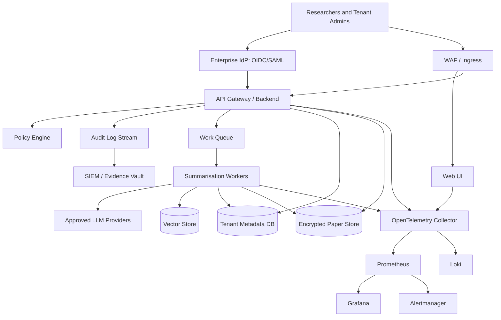

# V17 Enterprise Architecture

## Objectives

V17 provides a production deployment blueprint for an enterprise AI research platform that summarises arXiv papers while meeting requirements for tenant isolation, security, compliance, observability, and reliable operations.

## Reference architecture

## Multi-tenant model

V17 supports three tenancy patterns. The default is namespace-per-tenant because it balances isolation and operability.

| Pattern | Isolation | Operational cost | Recommended use |
| --- | --- | --- | --- |
| Namespace per tenant | Strong Kubernetes isolation with shared control plane | Medium | Default enterprise deployment |
| Database schema per tenant | Shared runtime with logical data isolation | Low | Internal teams with low regulatory exposure |
| Cluster per tenant | Highest isolation | High | Regulated or customer-dedicated environments |

Tenant isolation controls include:

- Kubernetes namespaces named `tenant-<slug>`.
- NetworkPolicies that deny cross-tenant traffic by default.
- ResourceQuota and LimitRange per tenant.
- Tenant-scoped service accounts and RBAC bindings.
- Tenant identifier propagation through HTTP headers, queue messages, audit events, metrics labels, and database rows.
- Optional customer-managed encryption keys for dedicated tenants.

## Security and SSO

Authentication is delegated to an enterprise identity provider through OIDC or SAML. Authorization is enforced through tenant-aware RBAC:

- `platform-admin`: cluster and platform operations.
- `tenant-admin`: user, quota, retention, and export controls for one tenant.
- `researcher`: paper ingestion, summarisation, and approved exports.
- `auditor`: read-only access to audit evidence and compliance reports.

Security baseline:

- TLS everywhere, including service-to-service traffic where mesh support is enabled.
- Secrets stored in external secret stores and synced by External Secrets Operator.
- Container images signed and scanned before deployment.
- Admission controls prevent privileged pods, host networking, mutable tags, and missing resource limits.
- Egress is restricted to approved model providers, arXiv endpoints, package registries, and monitoring sinks.

## Audit logging

Audit events are append-only JSON records emitted for all security and compliance-relevant activity. Events include actor identity, tenant, action, resource, result, source IP, request ID, correlation ID, and immutable event timestamp.

Required audited actions:

- Login, logout, token refresh, and failed authentication.
- Role assignment and privilege changes.
- Tenant creation, suspension, quota update, and deletion.
- Paper ingestion, summarisation, export, and deletion.
- Model-provider selection and prompt-template changes.
- Data retention changes and legal hold operations.
- Administrative configuration changes.

## Observability and monitoring

The stack uses OpenTelemetry for traces, metrics, and logs. Prometheus records SLO metrics and Alertmanager routes incidents. Grafana dashboards cover:

- API latency and error rate.
- Worker throughput and queue depth.
- Tenant consumption and quota pressure.
- Model-provider latency, failures, token usage, and cost indicators.
- Kubernetes health, saturation, and autoscaling behavior.
- Audit-log delivery lag.

## Compliance features

V17 includes controls for SOC 2, ISO 27001, GDPR-style data rights, and enterprise procurement reviews:

- Data inventory and classification for papers, summaries, prompts, embeddings, and audit records.
- Configurable retention and deletion policies.
- Export controls with approval workflows.
- Evidence collection checklist for access reviews, change management, incidents, backups, scans, and vulnerability remediation.
- Policy-as-code guardrails for Kubernetes deployments.
- Disaster recovery objectives and backup cadence.

## Production readiness checklist

- [ ] Dedicated production AWS account or equivalent cloud subscription.
- [ ] Private Kubernetes control plane endpoint.
- [ ] Encrypted managed databases and object storage.
- [ ] Centralized identity provider configured.
- [ ] SIEM integration receiving audit stream.
- [ ] Backup restore test completed.
- [ ] Load test completed at target tenant count.
- [ ] Incident runbooks reviewed by on-call team.
- [ ] Change-management process enforced in CI/CD.
