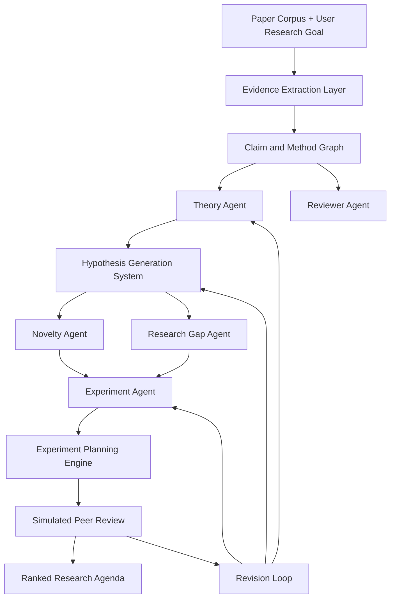
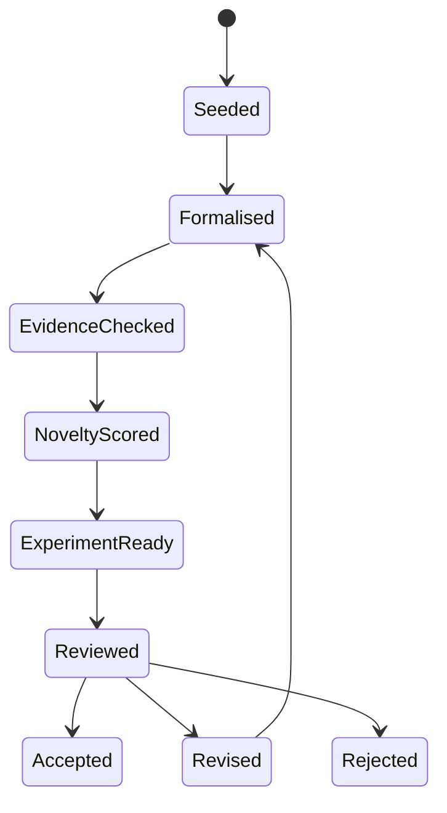

# V10 Autonomous AI Scientist Platform

V10 upgrades the arXiv paper summariser into an autonomous AI scientist system that can reason across papers, generate hypotheses, design experiments, compare theories, critique evidence, and surface novel research directions.

## 1. Scientific Reasoning Architecture

### 1.1 Mission

The V10 platform turns a paper-centric summarisation workflow into a closed-loop scientific reasoning system. It ingests papers and domain context, extracts claims and evidence, builds theory graphs, generates testable hypotheses, plans experiments, simulates peer review, and prioritises high-novelty research gaps.

### 1.2 Core Principles

1. **Evidence first:** every claim, hypothesis, critique, and experiment must be linked to supporting or contradicting evidence.
2. **Theory aware:** papers are interpreted as contributions to competing theories, not isolated summaries.
3. **Experiment driven:** hypotheses must be transformed into measurable experimental plans with controls, metrics, and falsification criteria.
4. **Novelty calibrated:** proposed ideas are scored against known literature, adjacent fields, and unexplored combinations.
5. **Review simulated:** outputs are stress-tested by reviewer-style critique before being presented as recommendations.
6. **Human override:** researchers can lock assumptions, reject hypotheses, or provide domain constraints at every stage.

### 1.3 High-Level Data Flow



### 1.4 Shared Scientific Memory

V10 agents coordinate through a shared memory model:

| Memory Store | Purpose | Example Records |
| --- | --- | --- |
| Paper Store | Raw papers, metadata, sections, figures, citations | arXiv ID, abstract, methods, results |
| Claim Graph | Atomic claims and relationships | supports, contradicts, extends, assumes |
| Evidence Ledger | Evidence strength and provenance | sample size, benchmark, ablation, statistical test |
| Theory Graph | Competing theories and mechanisms | assumptions, predictions, boundary conditions |
| Experiment Registry | Proposed and completed experiments | protocol, variables, metrics, risks |
| Novelty Map | Known and unexplored research spaces | under-studied combinations, emerging methods |
| Review Archive | Simulated reviews and critique history | weaknesses, rebuttals, revision requests |

### 1.5 Agent Contract

Every V10 agent uses the same output envelope so downstream agents can audit and reuse results:

```yaml
agent_output:
  agent: string
  task_id: string
  research_question: string
  claims:
    - text: string
      evidence_refs: [string]
      confidence: low|medium|high
  reasoning_trace:
    - step: string
      assumption: string
      uncertainty: string
  recommendations:
    - action: string
      rationale: string
      priority: low|medium|high
  critique:
    limitations: [string]
    failure_modes: [string]
  next_agent_handoff:
    target_agent: string
    requested_action: string
```

## 2. V10 Agent System

### 2.1 Theory Agent

**Role:** Generate, formalise, compare, and revise theories.

**Responsibilities:**

- Convert paper claims into candidate theories and mechanisms.
- Identify assumptions, predictions, and boundary conditions.
- Compare theories against the evidence ledger.
- Detect internal contradictions and missing mechanisms.
- Produce theory revision proposals when evidence conflicts with current models.

**Inputs:** claim graph, evidence ledger, user research question, prior theories.

**Outputs:** theory cards, theory comparison matrices, mechanism maps, unresolved contradictions.

### 2.2 Experiment Agent

**Role:** Transform hypotheses into rigorous experimental plans.

**Responsibilities:**

- Select variables, interventions, controls, baselines, and datasets.
- Define measurable outcomes and falsification criteria.
- Estimate feasibility, cost, runtime, and ethical or safety constraints.
- Create experiment sequences that distinguish between competing theories.
- Recommend ablations, robustness checks, and replication strategies.

**Inputs:** hypotheses, theory predictions, evidence weaknesses, resource constraints.

**Outputs:** experiment plans, execution protocols, evaluation rubrics, risk registers.

### 2.3 Reviewer Agent

**Role:** Simulate peer review and adversarial scientific critique.

**Responsibilities:**

- Critique papers, hypotheses, theories, and experiment plans.
- Identify weak evidence, confounders, unsupported assumptions, and overclaims.
- Score novelty, significance, clarity, reproducibility, and validity.
- Produce reviewer-style accept/revise/reject recommendations.
- Generate rebuttal questions and required revisions.

**Inputs:** papers, evidence ledger, theory cards, experiment plans.

**Outputs:** review reports, weakness lists, rebuttal prompts, revision tasks.

### 2.4 Novelty Agent

**Role:** Estimate originality and generate novel research ideas.

**Responsibilities:**

- Compare proposed ideas with existing literature and adjacent domains.
- Find underexplored combinations of methods, datasets, tasks, and theories.
- Identify surprising transfers from one field to another.
- Penalise ideas that are merely incremental or already saturated.
- Produce novelty rationales and nearest-neighbour prior work.

**Inputs:** paper corpus, embeddings, citation graph, theory graph, hypotheses.

**Outputs:** novelty scores, nearest prior work, idea variants, originality risks.

### 2.5 Research Gap Agent

**Role:** Identify unexplored research spaces and strategic opportunities.

**Responsibilities:**

- Map what has been studied versus what remains under-tested.
- Detect missing datasets, populations, mechanisms, benchmarks, and conditions.
- Rank gaps by scientific value, feasibility, and evidence leverage.
- Connect gaps to experiment plans and theory-discriminating predictions.
- Maintain a living research agenda.

**Inputs:** novelty map, claim graph, citation graph, evidence ledger, user goals.

**Outputs:** research gap maps, opportunity rankings, agenda items, open questions.

## 3. Hypothesis Generation System

### 3.1 Hypothesis Lifecycle



### 3.2 Hypothesis Template

```yaml
hypothesis:
  id: HYP-V10-0001
  statement: "If [intervention/mechanism], then [observable outcome] under [conditions]."
  domain: string
  theory_links: [theory_id]
  mechanism: string
  independent_variables: [string]
  dependent_variables: [string]
  boundary_conditions: [string]
  falsification_criteria: [string]
  supporting_evidence: [evidence_id]
  contradicting_evidence: [evidence_id]
  novelty_score: 0.0-1.0
  feasibility_score: 0.0-1.0
  risk_level: low|medium|high
  next_experiment: experiment_id
```

### 3.3 Generation Strategies

| Strategy | Description | Example Use |
| --- | --- | --- |
| Contradiction mining | Generate hypotheses from conflicts between claims or theories | Explain why one model works on benchmark A but fails on benchmark B |
| Boundary expansion | Test whether a theory holds outside known conditions | Apply a method to longer contexts, lower-resource languages, or noisy data |
| Mechanism substitution | Replace one assumed mechanism with another plausible mechanism | Compare retrieval-based grounding with parametric memorisation |
| Cross-domain transfer | Borrow mechanisms from adjacent fields | Apply ecological resilience concepts to model robustness |
| Missing-variable search | Add variables that prior work ignored | Include dataset contamination, calibration, or human factors |
| Failure-driven ideation | Turn observed failures into testable research directions | Hypothesise that failures cluster around specific causal structures |

### 3.4 Hypothesis Quality Rubric

Each hypothesis receives five scores:

1. **Testability:** can it be falsified with observable measurements?
2. **Specificity:** are variables, conditions, and expected effects explicit?
3. **Evidence leverage:** would testing it resolve meaningful uncertainty?
4. **Novelty:** is it distinct from known prior work?
5. **Feasibility:** can it be tested with available resources?

## 4. Experiment Planning Engine

### 4.1 Planning Pipeline

```mermaid
flowchart LR
    A[Hypothesis] --> B[Operationalise Variables]
    B --> C[Select Experimental Design]
    C --> D[Choose Datasets and Baselines]
    D --> E[Define Metrics]
    E --> F[Add Controls and Ablations]
    F --> G[Power and Feasibility Check]
    G --> H[Risk and Ethics Review]
    H --> I[Execution Protocol]
    I --> J[Reviewer Stress Test]
```



### 4.2 Experiment Plan Schema

```yaml
experiment_plan:
  id: EXP-V10-0001
  hypothesis_id: HYP-V10-0001
  objective: string
  design_type: observational|controlled|ablation|simulation|benchmark|human_study
  variables:
    independent: [string]
    dependent: [string]
    controls: [string]
    confounders: [string]
  datasets:
    primary: [string]
    validation: [string]
    exclusion_criteria: [string]
  baselines: [string]
  metrics:
    primary: [string]
    secondary: [string]
    robustness: [string]
  protocol:
    steps: [string]
    randomisation: string
    blinding: string
    replication: string
  falsification:
    expected_result: string
    null_result_interpretation: string
    disconfirming_result: string
  feasibility:
    compute_cost: low|medium|high
    data_availability: low|medium|high
    implementation_complexity: low|medium|high
  ethics_and_safety:
    risks: [string]
    mitigations: [string]
  review_gate:
    minimum_evidence_quality: low|medium|high
    required_revisions: [string]
```

### 4.3 Design Selection Heuristics

- Use **controlled experiments** when causal effects can be isolated.
- Use **ablation studies** when testing the contribution of a component or mechanism.
- Use **benchmark comparisons** when assessing empirical performance across tasks.
- Use **simulation** when real-world experimentation is expensive, unsafe, or slow.
- Use **human studies** when claims depend on human judgement, behaviour, or usability.
- Use **replication plans** when the evidence ledger marks a result as influential but weakly supported.

### 4.4 Evidence Weakness Detection

The engine flags weak evidence when it detects:

- no control group or weak baseline;
- small or unreported sample size;
- missing statistical uncertainty;
- benchmark overfitting or dataset leakage risk;
- missing negative results;
- unsupported causal language;
- lack of ablation or sensitivity analysis;
- insufficient replication detail;
- mismatch between claim scope and tested conditions.

## 5. Theory Comparison Workflows

### 5.1 Theory Card

```yaml
theory_card:
  id: TH-V10-0001
  name: string
  summary: string
  core_mechanism: string
  assumptions: [string]
  predictions:
    - prediction: string
      measurable_indicator: string
      expected_direction: string
  boundary_conditions: [string]
  supporting_evidence: [evidence_id]
  contradicting_evidence: [evidence_id]
  open_questions: [string]
  status: emerging|supported|contested|weakened|rejected
```

### 5.2 Comparison Matrix

| Criterion | Theory A | Theory B | Decision Rule |
| --- | --- | --- | --- |
| Predictive accuracy | Measured across datasets | Measured across datasets | Prefer higher out-of-sample accuracy |
| Mechanistic clarity | Explicit causal pathway | Explicit causal pathway | Prefer fewer hidden assumptions |
| Evidence coverage | Supported claims | Supported claims | Prefer broader high-quality support |
| Contradictions | Known conflicts | Known conflicts | Penalise unresolved contradictions |
| Falsifiability | Clear disconfirming tests | Clear disconfirming tests | Prefer stronger falsification criteria |
| Parsimony | Number of assumptions | Number of assumptions | Prefer simpler sufficient theory |
| Generalisability | Boundary conditions | Boundary conditions | Prefer tested robustness |

### 5.3 Workflow: Compare Competing Theories

1. Extract candidate theories from papers and user-provided context.
2. Convert each theory into a theory card with assumptions and predictions.
3. Link each prediction to evidence in the evidence ledger.
4. Score evidence quality for each linked claim.
5. Identify predictions where theories diverge.
6. Ask the Experiment Agent to design discriminating experiments.
7. Ask the Reviewer Agent to critique whether the comparison is fair.
8. Update theory status after review and experimental results.

### 5.4 Workflow: Critique a Paper

1. Parse the paper into claims, methods, results, and limitations.
2. Map claims to evidence and identify unsupported statements.
3. Detect methodological weaknesses and missing controls.
4. Compare the paper's interpretation with competing theories.
5. Score reproducibility and evidence strength.
6. Generate reviewer comments and required revisions.
7. Convert unresolved weaknesses into research gaps or new hypotheses.

## 6. Autonomous Research Loop

### 6.1 Loop Stages

1. **Ingest:** collect papers, metadata, citations, and researcher goals.
2. **Understand:** extract claims, methods, assumptions, and evidence.
3. **Theorise:** build and compare explanatory theories.
4. **Hypothesise:** generate testable hypotheses from gaps, conflicts, and mechanisms.
5. **Novelty check:** compare ideas against existing and adjacent work.
6. **Plan:** design experiments with controls, metrics, and falsification criteria.
7. **Review:** simulate peer review and adversarial critique.
8. **Rank:** prioritise research agenda items by novelty, feasibility, and impact.
9. **Revise:** feed critique back into theories, hypotheses, and plans.

### 6.2 Ranking Formula

```text
research_priority =
  0.25 * evidence_leverage +
  0.20 * novelty_score +
  0.20 * theory_discrimination +
  0.15 * feasibility_score +
  0.10 * expected_impact +
  0.10 * reviewer_confidence -
  0.15 * risk_penalty
```

### 6.3 Human-in-the-Loop Gates

- Approve or edit research goals before autonomous planning.
- Lock critical assumptions that must not be changed automatically.
- Require approval before human-subject or safety-sensitive experiments.
- Allow researchers to mark papers or theories as authoritative, disputed, or out of scope.
- Require final approval before publishing reports or claims.

## 7. V10 Deliverables

V10 produces the following artefacts for each research goal:

- theory graph and theory comparison matrix;
- ranked hypotheses with evidence links;
- experiment plans with controls, metrics, and falsification criteria;
- paper critique reports with weak-evidence flags;
- novelty and research gap maps;
- simulated peer-review reports;
- ranked autonomous research agenda.

## 8. Implementation Roadmap

### Phase 1: Reasoning Substrate

- Add paper, claim, evidence, theory, hypothesis, experiment, review, and gap schemas.
- Build extraction pipelines for claims, methods, results, and limitations.
- Implement shared memory stores and provenance tracking.

### Phase 2: Agent Orchestration

- Implement Theory, Experiment, Reviewer, Novelty, and Research Gap agents.
- Add the shared agent output envelope.
- Add handoff rules and revision loops.

### Phase 3: Scientific Engines

- Implement hypothesis generation strategies.
- Implement the experiment planning engine.
- Implement theory comparison workflows.
- Implement weak-evidence detection and novelty scoring.

### Phase 4: Autonomous Research Agenda

- Add ranking, review, and human approval gates.
- Generate exportable research agendas.
- Add audit logs for every agent decision.
