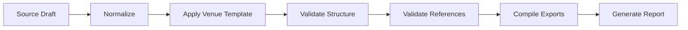

# V14 Formatting Pipelines

## Purpose

Formatting pipelines transform an author draft into a venue-compliant submission package. Pipelines are venue-aware, repeatable, and designed to run before reviewer simulation, before initial submission, and before camera-ready upload.

## Venue Profile

Each conference or journal profile contains:

- Template type: LaTeX, Word, Markdown, or hybrid.
- Page limits for main text, references, appendices, and supplementary material.
- Required sections such as ethics statements, limitations, reproducibility checklists, or impact statements.
- Anonymity requirements.
- Citation style and bibliography constraints.
- Figure, table, font, margin, and column constraints.
- Accepted export formats.

## Pipeline Stages

### 1. Normalize

- Standardize headings.
- Extract metadata.
- Normalize citations and bibliography keys.
- Detect figures, tables, algorithms, equations, and appendices.

### 2. Apply Venue Template

- Select the venue layout.
- Insert required packages or style files.
- Map manuscript sections to template slots.
- Apply anonymization rules for double-blind submissions.

### 3. Validate Structure

- Check required sections.
- Check page, word, and abstract limits.
- Check figure and table placement.
- Check appendix and supplementary material boundaries.

### 4. Validate References

- Verify all in-text citations resolve to bibliography entries.
- Verify bibliography entries are cited when required.
- Normalize citation ordering and style.
- Flag missing DOI, venue, year, or author metadata.

### 5. Compile Exports

- Build PDF.
- Bundle LaTeX or Word source.
- Export clean bibliography.
- Generate supplementary archive.

### 6. Generate Report

The final formatting report includes:

- Pass/fail venue compliance summary.
- Warnings for likely desk-reject risks.
- Page-limit and anonymization results.
- Reference validation results.
- Artifact checklist.

## Pipeline Interfaces

Formatting pipelines expose four author-facing commands:

- `profile venue`: create or update a venue profile.
- `format draft`: apply the target venue template.
- `validate submission`: run structure, citation, and anonymization checks.
- `package submission`: create the final upload bundle.
