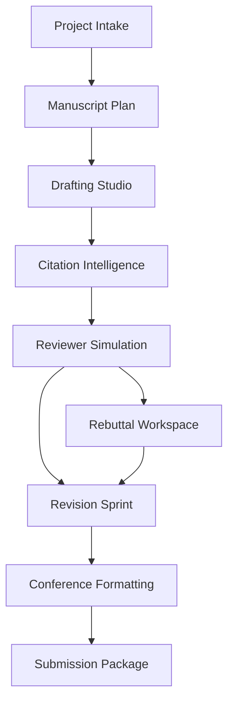

# V14 Publication Workflows

## Workflow Map

V14 organizes research-paper production into eight linked workflows. Each workflow produces artifacts that can feed the next stage or be revisited after reviewer simulation.

## 1. Project Intake

**Purpose:** Collect the minimum context needed to guide paper creation.

**Inputs**

- Target venue, track, and submission deadline.
- Research question, hypothesis, methods, datasets, and expected contributions.
- Existing notes, figures, experiments, BibTeX, and draft sections.
- Compliance constraints such as page limits, anonymity, and artifact policies.

**Outputs**

- Venue profile.
- Contribution checklist.
- Risk register for missing experiments, citations, ethics statements, or reproducibility artifacts.

## 2. Manuscript Plan

**Purpose:** Convert raw research context into a paper blueprint.

**Generated artifacts**

- Title candidates.
- Abstract brief with problem, method, result, and contribution slots.
- Section-by-section outline.
- Figure and table plan.
- Claim inventory linking each major claim to evidence requirements.

## 3. Drafting Studio

**Purpose:** Help authors produce conference-ready prose.

**Supported generation tasks**

- Abstract generation in structured, narrative, and venue-specific styles.
- Introduction framing with motivation, gap, approach, and contribution paragraphs.
- Related-work writing from citation clusters.
- Methods drafting from experimental notes.
- Limitation, ethics, reproducibility, and broader-impact sections.

**Quality gates**

- No uncited claims in background or related work.
- No fabricated results or citations.
- Clear distinction between user-provided evidence and model-generated suggestions.

## 4. Citation Intelligence Review

**Purpose:** Improve grounding before simulated peer review.

**Checks**

- Missing seminal citations.
- Missing recent citations.
- Unsupported claims.
- Citation overloading.
- Citation format consistency.
- Potential plagiarism or excessive textual overlap.
- Novelty conflicts with prior work.

## 5. Reviewer Simulation Loop

**Purpose:** Surface likely peer-review objections before submission.

**Process**

1. Select venue-specific reviewer profiles.
2. Generate independent reviews with scores and confidence levels.
3. Merge critiques into a decision memo.
4. Prioritize fixes by severity and revision cost.
5. Re-run simulation after revisions.

## 6. Revision Sprint

**Purpose:** Convert critique into concrete manuscript improvements.

**Artifacts**

- Issue backlog grouped by clarity, novelty, methodology, evidence, writing, and formatting.
- Suggested rewrites.
- Experiment and analysis TODOs.
- Before-and-after claim validation.

## 7. Rebuttal Workspace

**Purpose:** Help authors respond to reviews during discussion periods.

**Generated artifacts**

- Reviewer concern matrix.
- Response strategy per concern: agree-and-fix, clarify, correct misunderstanding, or provide evidence.
- Concise rebuttal drafts with citations to manuscript sections, figures, or supplementary material.
- Revision commitments and final response checklist.

## 8. Submission Package

**Purpose:** Produce final venue-compliant deliverables.

**Exports**

- PDF manuscript.
- LaTeX or Word source package.
- BibTeX file.
- Supplementary material bundle.
- Reproducibility checklist.
- Anonymization report.
- Formatting validation report.
