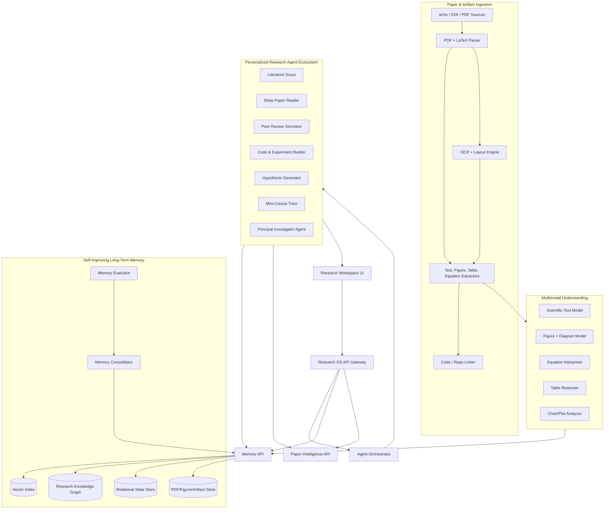
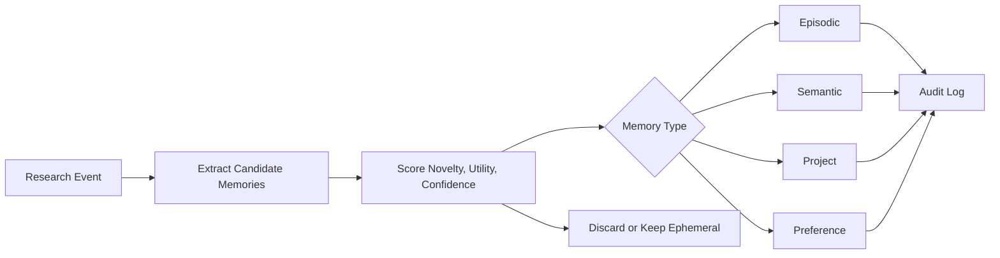
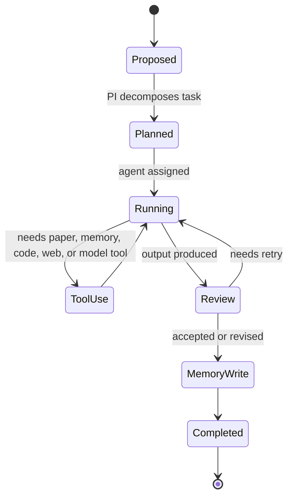
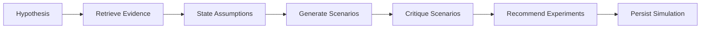

# Arxiv Research Copilot V6: AI-Native Research Operating System

## 1. Product Vision

V6 transforms Arxiv Research Copilot from a paper summarizer into a persistent AI research operating system: a long-running scientific partner that reads papers, remembers user intent, tracks research programs, proposes hypotheses, designs experiments, interprets multimodal scientific content, and continuously improves its own research memory.

The system should feel like an autonomous AI scientist with a personalized research brain. It does not only answer questions about papers; it maintains research state, reasons across months of reading history, detects gaps in the literature, creates implementation plans, writes code from papers, simulates peer review, and turns research areas into evolving knowledge maps and mini-courses.

## 2. Core Design Principles

1. **Persistent by default**: every paper, question, annotation, hypothesis, experiment, generated artifact, and user preference becomes part of long-term research memory.
2. **Agentic, not chat-only**: the system uses specialized agents with explicit goals, tools, plans, memory access, and evaluation loops.
3. **Multimodal-native**: text, equations, figures, tables, graphs, diagrams, and code are first-class research objects.
4. **Traceable science**: every generated claim links back to source passages, equations, figures, tables, or prior user decisions.
5. **Self-improving memory**: the memory layer is evaluated, compressed, corrected, and reorganized over time.
6. **Human-steered autonomy**: the copilot can run independently, but users control research priorities, risk tolerance, publication goals, and agent permissions.
7. **Composable infrastructure**: ingestion, extraction, retrieval, reasoning, simulation, and generation pipelines are independent services connected by durable orchestration.

## 3. System Architecture Overview



## 4. Domain Model

### 4.1 Research Objects

| Object | Description | Key Fields |
| --- | --- | --- |
| `Paper` | Canonical paper entity | title, authors, arXiv ID, DOI, venue, date, versions, source files |
| `PaperSegment` | Parsed section, paragraph, theorem, proof, caption, appendix item | paper ID, section path, text, citations, embeddings |
| `Equation` | Equation or symbolic expression | LaTeX, variables, natural-language explanation, dependencies, image crop |
| `Figure` | Figure, plot, architecture diagram, graph, or visual result | caption, image, subfigures, detected axes, visual claims |
| `Table` | Structured or semi-structured tabular result | schema, cells, metrics, baselines, highlighted comparisons |
| `Method` | Algorithm, model, theorem, proof strategy, system design, or experimental procedure | assumptions, steps, dependencies, limitations |
| `Claim` | Atomic scientific claim | source evidence, confidence, supporting and contradicting papers |
| `Hypothesis` | User- or AI-generated research direction | rationale, novelty, risks, experiment plan, status |
| `Experiment` | Proposed or executed experiment | protocol, datasets, metrics, compute, results, artifacts |
| `ResearchThread` | Long-lived research goal | objective, milestones, open questions, linked memories |
| `UserProfile` | Personal research style and priorities | fields, preferred depth, coding stack, recurring interests |
| `AgentRun` | Auditable autonomous run | plan, tools used, memories read/written, outputs, evaluation |

### 4.2 Knowledge Graph Edges

- `PAPER_CITES_PAPER`
- `PAPER_PROPOSES_METHOD`
- `METHOD_IMPROVES_ON_METHOD`
- `FIGURE_SUPPORTS_CLAIM`
- `EQUATION_DEFINES_VARIABLE`
- `TABLE_REPORTS_METRIC`
- `CLAIM_CONTRADICTS_CLAIM`
- `HYPOTHESIS_TESTED_BY_EXPERIMENT`
- `USER_INTERESTED_IN_TOPIC`
- `RESEARCH_THREAD_DEPENDS_ON_THREAD`
- `AGENT_RUN_UPDATED_MEMORY`

## 5. Multimodal Paper Understanding Pipeline

### 5.1 Ingestion Stages

1. **Acquisition**
   - Fetch PDFs, source LaTeX, metadata, citation graph entries, linked repositories, datasets, and supplementary material.
   - Normalize versions so follow-up readings can detect what changed between paper revisions.
2. **Layout-aware parsing**
   - Extract sections, paragraphs, headers, footnotes, captions, references, appendices, theorem blocks, algorithms, equations, and page coordinates.
   - Preserve bounding boxes for citation-backed UI highlighting.
3. **Scientific object extraction**
   - Split the paper into research objects: claims, methods, equations, figures, tables, datasets, metrics, baselines, assumptions, limitations, and open questions.
4. **Multimodal interpretation**
   - Send text, equation crops, figure crops, tables, and captions to specialized interpreters.
   - Produce structured descriptions and evidence-linked interpretations.
5. **Cross-object reconciliation**
   - Link equations to surrounding definitions, figures to claims, tables to experiment descriptions, and algorithms to implementation plans.
6. **Memory write**
   - Persist raw artifacts, structured objects, embeddings, graph edges, summaries, uncertainty scores, and user-facing cards.

### 5.2 Equation Interpretation

The equation interpreter converts mathematical content into executable and conceptual representations.

**Pipeline**

1. Detect displayed and inline equations with page coordinates.
2. Recover LaTeX from source files when available; otherwise use equation OCR.
3. Parse symbolic structure into an abstract syntax tree.
4. Resolve variables from nearby definitions and notation tables.
5. Generate:
   - plain-English explanation,
   - variable glossary,
   - dimensional or shape analysis,
   - algorithmic pseudocode,
   - PyTorch/JAX/NumPy sketch when applicable,
   - dependency links to prior equations.
6. Flag ambiguity when symbols are overloaded or undefined.

**Output schema**

```json
{
  "equation_id": "eq:paper123:4",
  "latex": "...",
  "role": "loss_function | update_rule | theorem_statement | bound | metric",
  "variables": [{"symbol": "...", "meaning": "...", "shape": "..."}],
  "explanation": "...",
  "implementation_notes": "...",
  "depends_on": ["eq:paper123:2"],
  "confidence": 0.82,
  "evidence": [{"page": 5, "bbox": [0, 0, 1, 1]}]
}
```

### 5.3 Figure, Diagram, and Graph Analysis

The visual pipeline treats figures as scientific arguments, not illustrations.

**Supported figure types**

- line charts, scatter plots, bar charts, ablation grids, confusion matrices,
- neural network and system architecture diagrams,
- algorithm flowcharts,
- qualitative result panels,
- mathematical diagrams,
- tables embedded as images.

**Analysis stages**

1. Classify figure type and detect subfigures.
2. Read axes, legends, labels, colors, nodes, arrows, and annotations.
3. Align caption claims with visible evidence.
4. Extract quantitative trends when possible.
5. Compare plotted methods against baselines mentioned in text.
6. Generate a visual evidence card:
   - what the figure shows,
   - what claim it supports,
   - whether the caption overclaims,
   - important caveats,
   - how to reproduce the figure.

### 5.4 Table Reasoning

The table reasoner converts benchmark tables into machine-queryable evidence.

- Recover rows, columns, merged headers, footnotes, bolded best values, and statistical markers.
- Normalize metrics and directionality: higher-is-better, lower-is-better, rank-based, confidence interval, p-value.
- Detect missing baselines and suspicious comparisons.
- Produce benchmark cards with dataset, metric, method, score, experimental setup, and caveats.

## 6. Self-Improving Memory System

### 6.1 Memory Tiers

| Tier | Purpose | Storage |
| --- | --- | --- |
| Episodic memory | User conversations, agent runs, paper reading sessions, decisions | relational DB + append-only event log |
| Semantic memory | Concepts, claims, methods, definitions, explanations | vector DB + graph DB |
| Procedural memory | Preferred workflows, coding templates, review rubrics, experiment patterns | document store + versioned prompts |
| Project memory | Long-term research threads, milestones, hypotheses, experiments | relational DB + graph DB |
| Artifact memory | PDFs, figures, code, generated notebooks, datasets | object store |
| Preference memory | User goals, taste, writing style, technical stack, trusted venues | relational DB |

### 6.2 Memory Write Policy

Every write is evaluated by a memory controller before persistence.



**Scoring dimensions**

- novelty against existing memory,
- expected future utility,
- evidence strength,
- user relevance,
- stability over time,
- contradiction risk,
- privacy sensitivity.

### 6.3 Memory Consolidation

A background consolidation job runs daily or after major research sessions.

1. Cluster related paper notes, claims, and hypotheses.
2. Merge duplicates and preserve provenance.
3. Generate higher-level research maps.
4. Detect stale or contradicted memories.
5. Summarize long conversations into durable project state.
6. Promote recurring user preferences into profile memory.
7. Create memory regression tests for important claims.

### 6.4 Memory Evaluation

The memory evaluator continuously tests retrieval quality.

- **Recall tests**: can the system retrieve papers previously read for a research question?
- **Precision tests**: are retrieved memories relevant and non-duplicative?
- **Temporal tests**: does the system distinguish older paper versions from newer ones?
- **Contradiction tests**: can it surface papers that dispute a stored claim?
- **Personalization tests**: do recommendations match user research priorities?

### 6.5 Forgetting and Correction

V6 needs safe memory editing.

- Users can delete papers, conversations, generated artifacts, or profile preferences.
- Corrections create new memory versions instead of silently overwriting evidence.
- Low-confidence memories decay unless reinforced by future use.
- Contradicted memories remain searchable but are marked superseded or disputed.

## 7. Personalized Research Agent Ecosystem

### 7.1 Principal Investigator Agent

The PI agent owns strategy and orchestration.

Responsibilities:

- maintain research agenda,
- decompose goals into agent tasks,
- decide when to read, critique, implement, or simulate,
- reconcile conflicting agent outputs,
- update long-term research threads,
- ask for human approval on high-impact actions.

### 7.2 Literature Scout Agent

Responsibilities:

- monitor arXiv, Semantic Scholar, OpenReview, GitHub, conference proceedings, and user-defined feeds,
- rank new papers by user profile and active research threads,
- generate weekly literature digests,
- detect emerging clusters and fast-moving topics,
- identify missing citations in user drafts.

### 7.3 Deep Paper Reader Agent

Responsibilities:

- perform structured paper reads,
- extract claims, assumptions, methods, equations, figures, tables, limitations, and reproducibility risks,
- produce short, medium, and expert-level summaries,
- create implementation plans and reading questions,
- link the paper into the knowledge graph.

### 7.4 Multimodal Analyst Agent

Responsibilities:

- interpret figures, graphs, diagrams, equations, algorithms, and tables,
- validate whether visual evidence supports textual claims,
- generate figure-by-figure explainers,
- create reproduction checklists for benchmark tables and plots.

### 7.5 Hypothesis Generator Agent

Responsibilities:

- synthesize gaps across papers,
- generate testable hypotheses,
- estimate novelty and feasibility,
- propose experiments, metrics, datasets, and expected outcomes,
- track hypothesis lifecycle from idea to experiment result.

### 7.6 Code and Experiment Builder Agent

Responsibilities:

- convert methods and equations into implementation plans,
- generate repository scaffolds, notebooks, tests, and experiment configs,
- identify missing details needed for reproduction,
- propose ablations and sanity checks,
- connect generated code to source equations and algorithm blocks.

### 7.7 Peer Review Simulator Agent

Responsibilities:

- simulate reviews from different reviewer personas,
- detect weaknesses, unsupported claims, missing baselines, and unclear contributions,
- produce accept/reject probability estimates with rationale,
- generate rebuttal suggestions and revision plans.

### 7.8 Tutor and Mini-Course Agent

Responsibilities:

- generate personalized learning paths from papers,
- create mini-courses, quizzes, flashcards, diagrams, and exercises,
- adapt depth to user expertise,
- connect prerequisites to active research goals.

## 8. Agent Orchestration Logic

### 8.1 Task Lifecycle



### 8.2 Orchestration Policy

The orchestrator uses durable workflows with resumable state.

1. Normalize user request into a `ResearchTask`.
2. Retrieve relevant project, semantic, preference, and episodic memories.
3. Ask PI agent to produce a plan with confidence, risks, and required agents.
4. Run independent agents in parallel.
5. Require structured outputs and evidence citations from each agent.
6. Use critic agents to evaluate high-impact outputs.
7. Reconcile outputs into a final research artifact.
8. Persist new memories, tasks, and artifacts.
9. Schedule follow-up tasks when autonomy is enabled.

### 8.3 Autonomy Levels

| Level | Behavior |
| --- | --- |
| 0: Manual | Only acts on direct user requests. |
| 1: Suggestive | Proposes next actions but does not run them. |
| 2: Assisted | Runs low-risk research tasks after user approval. |
| 3: Autonomous | Runs scheduled scouts, reading, memory consolidation, and draft generation. |
| 4: Research Operator | Executes experiments, code generation, benchmark tracking, and paper draft updates with policy guardrails. |

### 8.4 Agent Safety and Quality Gates

- Require source-grounded claims for scientific assertions.
- Separate speculation from evidence-backed conclusions.
- Escalate uncertain equation, figure, or table interpretations.
- Run reproducibility checks before claiming implementation fidelity.
- Use peer-review simulation before producing publication-facing claims.
- Maintain an audit trail of tools, memories, models, prompts, and generated artifacts.

## 9. Advanced AI Capabilities

### 9.1 Implementation Plan Generation

For each method, V6 can produce:

- architecture summary,
- algorithm steps,
- data pipeline,
- dependency list,
- model interfaces,
- training loop,
- evaluation suite,
- ablation plan,
- risks and missing details,
- source-linked equation and figure references.

### 9.2 Experiment Generation

Experiment plans include:

- hypothesis,
- datasets,
- controls,
- baselines,
- metrics,
- statistical tests,
- compute estimate,
- expected failure modes,
- reproducibility checklist,
- result interpretation guide.

### 9.3 Improvement Suggestions

The system suggests improvements by combining:

- known limitations from the paper,
- contradictory evidence from related work,
- missing ablations,
- weaknesses found in figures or tables,
- user goals and available compute,
- recent methods in the same research thread.

### 9.4 Weakness Detection

Weakness detection targets:

- unvalidated assumptions,
- dataset leakage,
- missing baselines,
- poor statistical significance,
- unclear novelty,
- non-reproducible implementation details,
- unsupported claims,
- inconsistent notation,
- overclaiming from figures,
- failure to compare with current state of the art.

### 9.5 Peer Review Simulation

Peer review simulation produces:

- reviewer personas,
- scores by criterion,
- main strengths,
- major weaknesses,
- required experiments,
- likely area chair concerns,
- rebuttal strategy,
- revision checklist.

### 9.6 Literature Surveys

The literature survey engine builds:

- topic taxonomy,
- historical timeline,
- method families,
- benchmark evolution,
- unresolved problems,
- contradictory findings,
- recommended reading order,
- citation-backed survey drafts.

### 9.7 Mini-Courses from Papers

Mini-courses include:

- prerequisite map,
- lecture notes,
- concept glossary,
- equation walkthroughs,
- figure explainers,
- quizzes,
- coding exercises,
- capstone reproduction task.

## 10. Research Simulation Engine

The research simulation engine explores research trajectories before users spend compute or writing time.

### 10.1 Simulation Types

- **Experiment outcome simulation**: estimate plausible outcomes and failure modes.
- **Reviewer simulation**: predict how reviewers may react to claims and evidence.
- **Ablation simulation**: forecast which components are likely to matter.
- **Literature movement simulation**: predict how a topic may evolve based on recent activity.
- **Implementation risk simulation**: identify bottlenecks in reproducing a method.

### 10.2 Simulation Loop



Simulation outputs are always labeled as forecasts, not facts, and include assumptions, uncertainty, and validation experiments.

## 11. Scalable Infrastructure

### 11.1 Service Architecture

| Service | Responsibility |
| --- | --- |
| API Gateway | Authentication, request routing, rate limits, streaming responses |
| Paper Ingestion Service | Fetch PDFs, metadata, source files, citations, repositories |
| Parsing Service | Layout parsing, OCR, extraction of text/equations/figures/tables |
| Multimodal Intelligence Service | Vision, equation, table, graph, and diagram interpretation |
| Memory Service | CRUD, retrieval, consolidation, memory scoring, correction |
| Agent Orchestration Service | Durable workflows, tool execution, task state, autonomy policies |
| Research Graph Service | Graph writes, graph queries, literature maps, contradiction search |
| Artifact Service | Store generated notebooks, code, reports, images, and exports |
| Evaluation Service | Memory tests, agent quality tests, hallucination checks, regression suites |
| Notification Service | Weekly digests, watchlist alerts, experiment reminders |

### 11.2 Recommended Stack

- **Frontend**: Next.js research workspace, streaming chat, paper canvas, knowledge graph explorer.
- **Backend**: Python FastAPI or TypeScript API gateway plus Python workers for scientific parsing.
- **Workflow engine**: Temporal, Dagster, or durable queue-based orchestration.
- **Queue**: Kafka, NATS, RabbitMQ, or cloud-native pub/sub.
- **Relational DB**: Postgres for users, tasks, runs, permissions, and metadata.
- **Vector DB**: pgvector, Qdrant, Weaviate, or Milvus for retrieval.
- **Graph DB**: Neo4j, Kùzu, Neptune, or Postgres graph extension for research relations.
- **Object store**: S3-compatible storage for PDFs, crops, generated artifacts, and notebooks.
- **Cache**: Redis for hot retrieval, locks, streaming sessions, and short-lived agent context.
- **Observability**: OpenTelemetry traces, structured logs, cost telemetry, quality dashboards.

### 11.3 Data Flow for a New Paper

1. User adds paper or scout discovers one.
2. Ingestion service fetches metadata, PDF, source, references, code links, and supplementary material.
3. Parsing service extracts layout and scientific objects.
4. Multimodal service interprets equations, figures, tables, and diagrams.
5. Deep Paper Reader produces structured summary and weakness analysis.
6. Memory service writes objects, embeddings, graph edges, and paper cards.
7. PI agent links the paper to active research threads.
8. UI shows summary, visual explainer, equation walkthrough, implementation plan, and suggested next actions.

## 12. User Experience

### 12.1 Research Workspace

- **Research cockpit**: active threads, agent tasks, watchlists, open questions, recent discoveries.
- **Paper canvas**: PDF viewer with source-grounded summaries, figure cards, equation explainers, and table analysis.
- **Knowledge graph**: concepts, claims, methods, datasets, authors, and contradictions.
- **Hypothesis board**: generated hypotheses with novelty, feasibility, risk, and experiment plans.
- **Experiment lab**: generated notebooks, configs, metrics, and result tracking.
- **Course mode**: personalized mini-courses and reading paths.

### 12.2 Example User Flows

**Autonomous literature tracking**

1. User creates a research thread: “efficient multimodal transformers for scientific documents.”
2. Scout monitors new papers and ranks them by relevance.
3. Reader summarizes top papers.
4. Multimodal Analyst extracts figure and table claims.
5. PI updates the thread and proposes experiments.
6. User receives a weekly digest with source-linked recommendations.

**Paper-to-code workflow**

1. User asks: “Implement this method.”
2. Reader extracts algorithm, equations, and experimental setup.
3. Equation Interpreter produces executable pseudocode.
4. Builder generates a repository scaffold and tests.
5. Critic checks missing details and reproduction risks.
6. Memory links generated code to paper evidence.

**Research idea workflow**

1. User asks for novel ideas in an active thread.
2. Hypothesis Generator retrieves related claims, limitations, and contradictions.
3. It proposes testable hypotheses.
4. Simulation engine forecasts likely outcomes and failure modes.
5. Builder creates experiment plans.
6. Peer Review Simulator critiques the strongest idea.

## 13. Evaluation Framework

### 13.1 System Metrics

- paper parsing accuracy,
- equation OCR and variable resolution accuracy,
- figure classification accuracy,
- table extraction F1,
- citation-grounding precision,
- retrieval precision and recall,
- memory consolidation quality,
- agent task success rate,
- hallucination rate,
- user acceptance rate for recommendations,
- time saved per research workflow,
- reproducibility success rate for generated code.

### 13.2 Benchmarks

- curated papers with gold summaries,
- equation-to-explanation datasets,
- chart and table QA datasets,
- paper-to-code reproduction tasks,
- literature survey tasks with expert grading,
- memory regression suites from user projects,
- peer-review simulation comparisons against real reviews when available.

### 13.3 Quality Gates

A generated research artifact must pass:

1. source citation check,
2. contradiction scan,
3. uncertainty labeling,
4. memory relevance check,
5. agent critic review for high-impact outputs,
6. user approval for external publication or costly compute actions.

## 14. Security, Privacy, and Governance

- Encrypt papers, notes, generated artifacts, and profile memory at rest.
- Separate tenant data by account and workspace.
- Provide memory export, deletion, and correction controls.
- Log agent actions and tool calls for auditability.
- Apply autonomy policies per workspace.
- Require explicit approval for spending money, contacting external services, running long compute jobs, or publishing content.
- Allow private, local, or enterprise deployments for sensitive research.

## 15. Phased V6 Delivery Plan

### Phase 1: Research Memory Foundation

- Canonical paper model.
- Research threads.
- Episodic and semantic memory.
- Source-grounded summaries.
- Basic knowledge graph.
- Memory CRUD, correction, and deletion.

### Phase 2: Multimodal Paper Intelligence

- Figure, table, and equation extraction.
- Equation explanations and variable glossaries.
- Figure evidence cards.
- Benchmark table normalization.
- Paper canvas UI.

### Phase 3: Agent Ecosystem

- PI, Scout, Reader, Critic, Builder, Hypothesis, and Tutor agents.
- Durable orchestration.
- Autonomy levels.
- Agent audit logs.
- Weekly literature digests.

### Phase 4: Research Generation and Simulation

- Hypothesis generation.
- Experiment planning.
- Paper-to-code workflows.
- Peer review simulation.
- Mini-course generation.
- Research simulation engine.

### Phase 5: Self-Improvement and Scale

- Memory consolidation and evaluation.
- Agent regression tests.
- Quality dashboards.
- Scalable distributed ingestion.
- Enterprise privacy controls.
- Research organization workspaces.

## 16. Example API Contracts

### 16.1 Create Research Thread

```http
POST /v6/research-threads
Content-Type: application/json

{
  "title": "Efficient multimodal transformers for scientific documents",
  "goals": ["track new papers", "find reproducible methods", "generate experiment ideas"],
  "autonomy_level": 3,
  "preferred_outputs": ["weekly_digest", "implementation_plan", "weakness_analysis"]
}
```

### 16.2 Analyze Paper

```http
POST /v6/papers/analyze
Content-Type: application/json

{
  "source": "https://arxiv.org/pdf/example",
  "include": ["summary", "figures", "tables", "equations", "implementation_plan", "peer_review"],
  "research_thread_id": "thread_123"
}
```

### 16.3 Generate Hypotheses

```http
POST /v6/hypotheses/generate
Content-Type: application/json

{
  "research_thread_id": "thread_123",
  "constraints": {
    "compute_budget": "single_8x_gpu_node",
    "timeline": "4_weeks",
    "risk_tolerance": "medium"
  },
  "count": 5
}
```

### 16.4 Agent Run Event

```json
{
  "agent_run_id": "run_789",
  "agent_type": "deep_paper_reader",
  "task": "analyze_paper",
  "inputs": ["paper_456"],
  "memories_read": ["thread_123", "profile_abc"],
  "artifacts_written": ["summary_001", "figure_cards_002"],
  "confidence": 0.87,
  "requires_user_review": false
}
```

## 17. Reference Implementation Modules

```text
apps/web/                         Research workspace UI
services/api/                     API gateway and auth
services/ingestion/               arXiv, DOI, PDF, source, citation ingestion
services/parser/                  layout, OCR, LaTeX, figure, table, equation extraction
services/multimodal/              figure, equation, table, graph, diagram reasoning
services/memory/                  memory CRUD, retrieval, consolidation, correction
services/orchestrator/            durable agent workflows and autonomy policies
services/agents/                  PI, Scout, Reader, Critic, Builder, Hypothesis, Tutor
services/evaluation/              quality gates, memory tests, regression benchmarks
packages/schemas/                 shared research object schemas
packages/prompts/                 versioned agent prompts and rubrics
packages/connectors/              arXiv, Semantic Scholar, OpenReview, GitHub, Zotero
infra/                            deployment, queues, databases, object storage, observability
```

## 18. V6 Definition of Done

V6 is successful when the system can independently maintain a user-specific research program over time. It should ingest new literature, understand papers multimodally, update a durable memory graph, propose hypotheses, design experiments, generate implementation plans, simulate peer review, teach concepts, and provide traceable scientific reasoning that improves with continued use.
