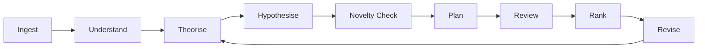

# arXiv Paper Summariser

V10 upgrades this project from a paper summarisation concept into an autonomous AI scientist platform for literature-grounded scientific reasoning.

## V10 Autonomous AI Scientist

The V10 system is designed to:

- generate hypotheses;
- design experiments;
- compare theories;
- critique papers;
- identify weak evidence;
- propose novel research ideas;
- simulate peer review;
- identify unexplored research spaces.

## V10 Agents

The platform architecture defines five specialist agents:

1. **Theory Agent** — builds and compares explanatory theories from paper claims and evidence.
2. **Experiment Agent** — converts hypotheses into controlled experiment plans with metrics, baselines, and falsification criteria.
3. **Reviewer Agent** — critiques papers, hypotheses, theories, and experiment plans using peer-review-style rubrics.
4. **Novelty Agent** — scores originality and proposes research ideas by comparing against known and adjacent work.
5. **Research Gap Agent** — maps unexplored spaces and maintains a ranked research agenda.

## Generated V10 Artefacts

- [Autonomous scientific reasoning architecture](docs/v10/autonomous-ai-scientist.md)
- [Experiment planning engine](docs/v10/autonomous-ai-scientist.md#4-experiment-planning-engine)
- [Theory comparison workflows](docs/v10/autonomous-ai-scientist.md#5-theory-comparison-workflows)
- [Hypothesis generation system](docs/v10/autonomous-ai-scientist.md#3-hypothesis-generation-system)
- [Machine-readable agent orchestration spec](docs/v10/agent-orchestration.yaml)

## V10 Research Loop

